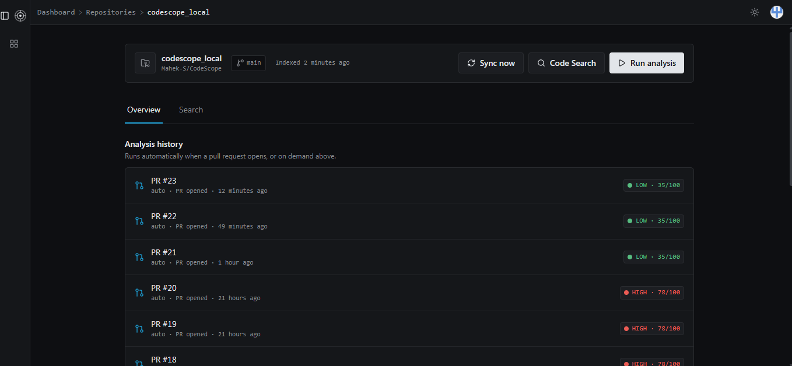
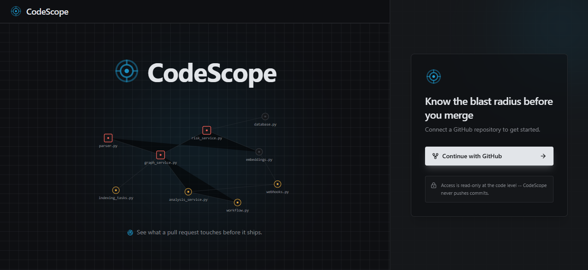
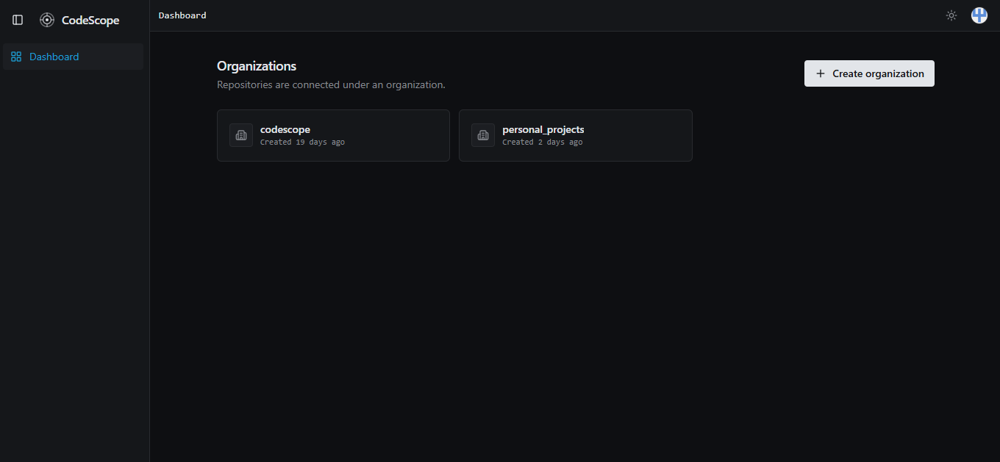
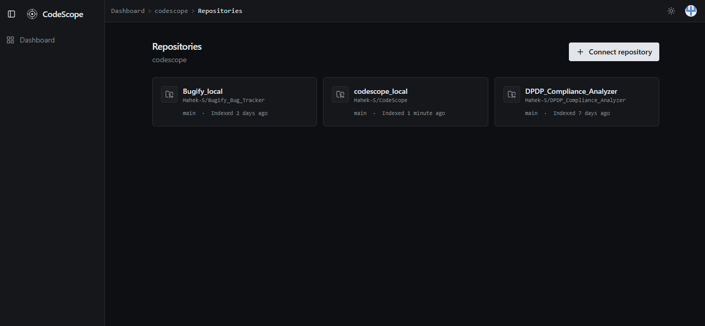
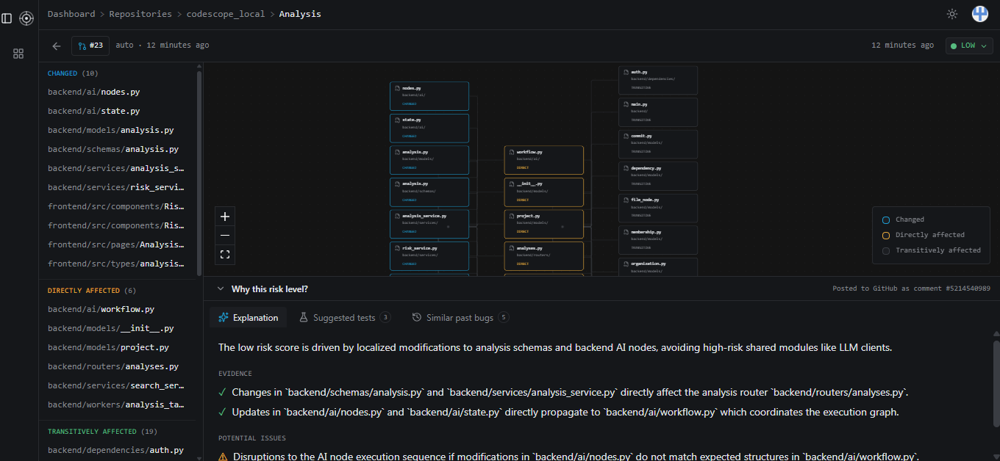
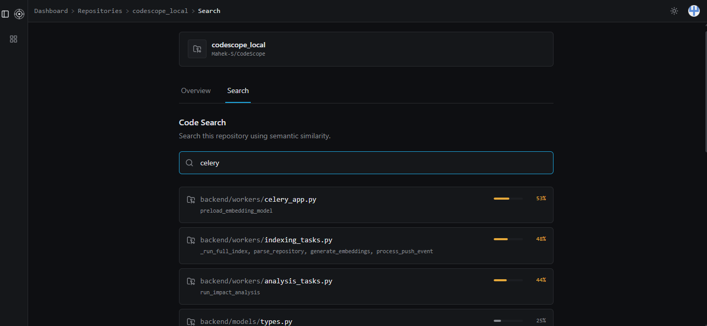
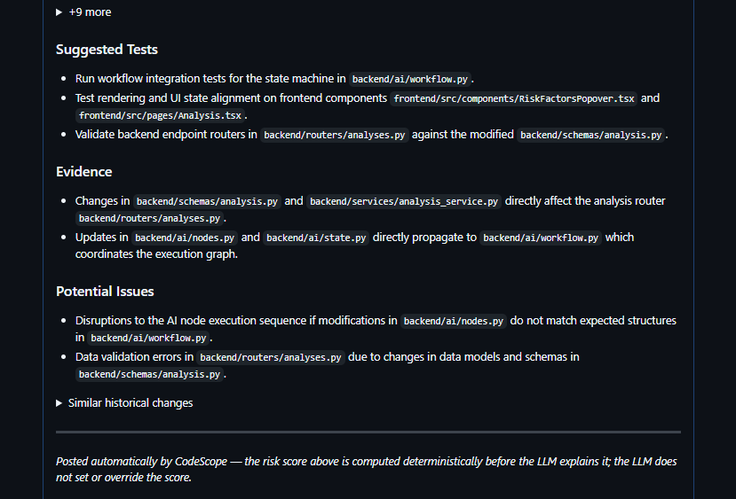

# CodeScope

## Automated PR Impact Analysis for Python Repositories




**An engineering workflow platform that continuously understands a Python codebase and automatically analyzes the impact of every pull request — without anyone having to ask.**

   

[Demo](#demo) · [Architecture](#architecture) · [Tech Stack](#tech-stack) · [Local Setup](#local-setup) · [API](#api-overview)

---

## The idea

Most AI coding tools are **reactive** — you paste code, ask a question, the context disappears when the chat ends. CodeScope is **proactive** — it listens to a GitHub repo via webhooks, keeps a live dependency graph and semantic index of the code, and reacts the moment a PR opens. No prompt required.

When a PR opens, CodeScope:
1. Traverses the dependency graph to find every directly and transitively affected file
2. Computes a **deterministic risk score** (fan-out, core-module touch, diff size, change frequency)
3. Retrieves similar past changes via pgvector similarity search
4. Sends the LLM the structural facts — not the raw diff — and asks it to *explain* the score with cited evidence
5. Posts the result as a structured GitHub PR comment, automatically

**The core rule: the LLM explains the risk score, it never invents one.** The score is computed first, as a plain number, before the model sees anything. The model is instructed — and structurally unable — to override it. That keeps the one part of the system that actually gates a merge decision fully deterministic and testable, while still getting natural-language reasoning where it adds real value.

| | Claude / Copilot in an editor | CodeScope |
|---|---|---|
| Trigger | Reactive — you ask | Proactive — a PR opens, it reasons |
| Memory | Forgets after the session | Persists across every commit |
| Context | Pasted in manually | Collected automatically via webhooks |
| Dependency awareness | None | Live graph, rebuilt on every push |
| Risk assessment | A confident guess | Computed deterministically, then explained |

---

## Demo

See CodeScope automatically analyze a pull request, post a GitHub review comment, visualize dependency impact, and perform semantic search.

▶️ **Watch the Demo:** https://youtu.be/UkRpBOiGCZA

**Screenshots**
### Authentication

| GitHub Login | Dashboard |
|:---------:|:-----------------:|
|  |  |

### Repository Management

| Repositories | Analysis Overview |
|:-------------:|:---------------:|
|  |  |

### Code Intelligence

| Analysis History | Semantic Search |
|:-------------:|:---------------:|
|  |  |

### GitHub Integration

<p align="center">
  
</p>

---

## Features

- **Always fresh.** Every push re-indexes automatically in the background (Celery) — AST parse, dependency graph, embeddings — no manual re-sync needed.
- **Semantic code search, not grep.** Every file gets a local sentence-transformer embedding (path, classes, functions, imports, docstring). Search "payment processing" and get files that are *about* payment processing. The endpoint reports `not_indexed` / `indexing` / `ready` / `model_unavailable` so a fresh repo looks like it's catching up, not broken.
- **An interactive dependency graph, not a text list.** The Analysis page renders the blast radius — changed → directly affected → transitively affected — as a React Flow graph, color-coded by distance, synced with a flat sidebar list.
- **A real dashboard.** Orgs → repos → analysis history → analysis detail, all backed by the same Postgres data the PR comment came from. Every analysis is browsable after the fact.

---

## Architecture

```
GitHub
  │  push / pull_request webhook (HMAC-verified, delivery-ID deduplicated)
  ▼
FastAPI
  │  enqueues
  ▼
Redis (Celery broker)
  │
  │  on EVERY push:
  ├── Parse changed files (Python's `ast`)
  ├── Rebuild file-level dependency graph
  └── Generate sentence-transformer embeddings
  │
  ▼
PostgreSQL + pgvector
  │
  │  on PR opened:
  ▼
LangGraph workflow (8 nodes)
┌───────────────┬────────────────┐
│ BFS graph     │  pgvector      │
│ traversal     │  similarity    │
│ (blast radius)│  search        │
└────────┬──────┴───────┬────────┘
         ▼               ▼
Deterministic risk score (no LLM)
                │
LLM reasoning — explains the score,
cites evidence, never overrides it
                │
                ▼
Structured JSON → PR comment + DB
                │
                ▼
React dashboard (history, graph, search)
```

**Remove the LLM and the product still works**: dependency graph, deterministic risk scoring, semantic search, and full commit/PR history all function without it. The LLM adds the plain-English explanation and test suggestions — it's a layer, not the foundation.

---

## Tech stack

| Layer | Technology | Why |
|---|---|---|
| Backend | FastAPI (async) | Fast, typed, first-class background task support |
| Database | PostgreSQL + pgvector | Relational data and vector search in one store |
| Cache / broker | Redis | Backs Celery |
| Background jobs | Celery | Indexing and analysis run off the request path |
| Embeddings | sentence-transformers (`all-MiniLM-L6-v2`, local) | No per-embedding API cost, runs on CPU |
| AI orchestration | LangGraph | Explicit, inspectable state machine over a single opaque prompt |
| LLM | Claude API | Structured JSON output for evidence-based explanations |
| GitHub integration | PyGithub + signed webhooks | Repo access, PR comments, idempotent event handling |
| Frontend | React + Vite + Tailwind | Fast iteration, small bundle |
| Auth | GitHub OAuth (Authlib) | Single sign-on, no separate credential store |
| Parsing | Python's built-in `ast` module | No hand-rolled parser to maintain |

---

## Key engineering decisions

- **Risk scoring is deterministic and runs before the LLM is invoked.** Fan-out, core-module detection, diff size, and change frequency combine into a numeric score with fixed weights (`services/risk_service.py`). Nothing downstream trusts an LLM-generated risk level.
- **File-level dependency graph, not symbol-level, for v1.** A full call graph is real scope for v2, not a missing feature. Reverse-adjacency BFS is enough to answer "what does this change affect" correctly, and far simpler to get right.
- **Webhook idempotency via a dedicated delivery-ID table**, not an "analysis already exists for this PR" check — the latter misses duplicate push events and can mask a legitimate second event sharing a PR number.
- **The LLM returns structured JSON, not free text.** The prompt requires cited, structural evidence — specific filenames, fan-out counts, prior PR numbers — so the explanation reads like a reviewer citing facts, not a model restating the risk label.
- **Full re-clone on every push**, not incremental diffing. At v1 repo sizes a shallow clone is fast enough that incremental sync isn't worth the complexity.
- **Indexing and embedding generation are separate Celery tasks.** AST parsing is fast filesystem work; embedding generation is model inference with a different cost/failure profile. A slow embedding step never blocks the dependency graph from updating.
- **Search distinguishes "no results" from "not indexed yet."** An explicit `status` field prevents a freshly connected repo from looking broken.

---

## Scope — v1

Python repositories, single GitHub repo per project, one AI workflow (Change Impact Analysis), solo-deployable via Docker Compose.

**Explicitly out of scope for v1:** symbol/function-level call graph, multi-language support, autonomous PR/issue creation, CI/CD or Slack integrations, fine-tuning or code generation.

---

## Local setup

**Prerequisites:** Docker & Docker Compose, a [GitHub OAuth App](https://github.com/settings/developers), an Anthropic/OpenAI/Gemini API key.

```bash
git clone https://github.com/<Mahek-S>/codescope.git
cd codescope
cp .env.example .env   # fill in the values below
docker compose up --build
```

| Variable | Description |
|---|---|
| `DATABASE_URL` / `DATABASE_URL_SYNC` | Postgres connection strings (async + sync) |
| `REDIS_URL` | Redis connection string, used by Celery |
| `GITHUB_CLIENT_ID` / `GITHUB_CLIENT_SECRET` | From your GitHub OAuth App |
| `GITHUB_WEBHOOK_SECRET` | Shared secret used to verify incoming webhook signatures |
| `PUBLIC_BASE_URL` | Publicly reachable backend URL (used to register the GitHub webhook) |
| `FRONTEND_URL` | Frontend origin, used for CORS and post-login redirect |
| `GEMINI_API_KEY` | For the impact-analysis LLM step |
| `SECRET_KEY` | Session cookie signing key |
| `TOKEN_ENCRYPTION_KEY` | Fernet key used to encrypt stored GitHub access tokens at rest |

Generate real secrets rather than reusing the `.env.example` placeholders:

```bash
python -c "from cryptography.fernet import Fernet; print(Fernet.generate_key().decode())"  # TOKEN_ENCRYPTION_KEY
openssl rand -hex 32   # SECRET_KEY, GITHUB_WEBHOOK_SECRET
```

Once running: `http://localhost:8000/health` (backend), `http://localhost:3000` (frontend). In local dev, expose the backend with `ngrok` and point your GitHub App's webhook at it to receive real push/PR events.

**Cloud deployment** (Vercel + Railway/Render + Neon + Upstash) is supported by the environment-variable-driven config — see `config.py` — but is not required to run or evaluate the project.

---

## API overview

```
GET  /auth/github               GitHub OAuth login
GET  /auth/github/callback      OAuth callback
GET  /auth/me                   Current session user
POST /auth/logout

POST /orgs                      Create organization
GET  /orgs                      List your organizations

POST /orgs/{org_id}/projects    Connect a GitHub repo
GET  /orgs/{org_id}/projects    List repos in an org
GET  /projects/{project_id}     Repo detail
POST /projects/{project_id}/sync  Manual re-index

POST /webhooks/github           GitHub push / pull_request events

GET  /projects/{project_id}/search?q=...   Semantic code search

GET  /projects/{project_id}/analyses       Analysis history
POST /projects/{project_id}/analyses       Trigger analysis manually
GET  /analyses/{analysis_id}               Full analysis detail
```

---

## Project structure

```
codescope/
├── backend/
│   ├── ai/          # LangGraph workflow, prompts, state, LLM client
│   ├── models/       # SQLAlchemy models
│   ├── routers/       # FastAPI route handlers
│   ├── services/        # Business logic (graph traversal, risk scoring, indexing, search)
│   ├── workers/           # Celery task definitions
│   └── utils/               # AST parser, git ops, embeddings, webhook signature verification
├── frontend/
│   └── src/
│       ├── pages/       # Dashboard, Project, Analysis, Search
│       ├── components/    # Dependency graph, risk tags, modals
│       └── hooks/            # Data-fetching hooks
└── docker-compose.yml
```

---

## Roadmap (v2)

- Symbol/function-level call graph, not just file-level imports
- Multi-language support beyond Python
- Slack and CI/CD integrations
- Configurable, per-project core-module rules for risk scoring

---

## License

MIT — see [LICENSE](./LICENSE).

---

Built by [Mahek Shah](https://github.com/Mahek-S) · [LinkedIn](https://www.linkedin.com/in/maheksshah/)